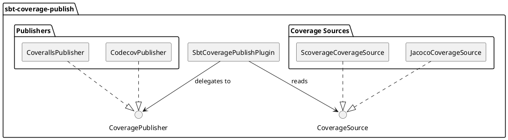
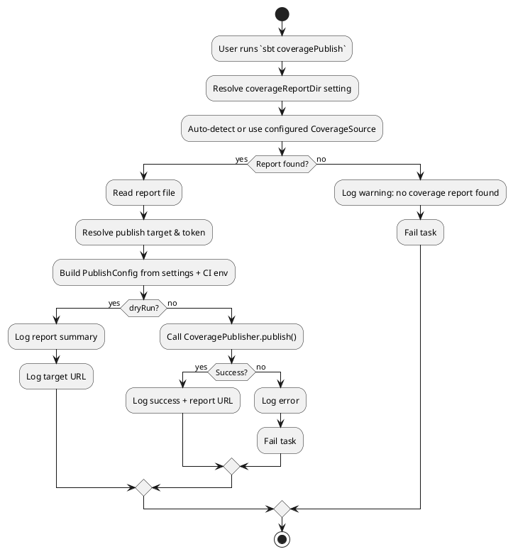

# sbt-coverage-publish — Design Document

## 1. Overview

**sbt-coverage-publish** is an sbt plugin that automates the publication of code coverage reports to external services. It aims to provide a single, unified `coveragePublish` task that collects coverage data produced by supported coverage tools and uploads it to configurable reporting platforms.

### Goals

- Simplify coverage report publishing in Scala/sbt projects
- Support multiple coverage tools as input sources
- Support multiple publishing targets
- Work seamlessly in both local development and CI environments
- Require minimal configuration for common setups

## 2. Current State

The project is scaffolded from the [sbt/sbt-autoplugin.g8](https://github.com/sbt/sbt-autoplugin.g8) template. The main plugin class [`SbtCoveragePublishPlugin`](src/main/scala/dev/cheleb/sbt/coveragepublish/SbtCoveragePublishPlugin.scala:7) contains only placeholder settings:

| Item | Description |
|------|-------------|
| [`exampleSetting`](src/main/scala/dev/cheleb/sbt/coveragepublish/SbtCoveragePublishPlugin.scala:13) | Placeholder `settingKey[String]` |
| [`exampleTask`](src/main/scala/dev/cheleb/sbt/coveragepublish/SbtCoveragePublishPlugin.scala:14) | Placeholder `taskKey[String]` |

The scripted test in [`src/sbt-test/sbt-coverage-publish/simple/test`](src/sbt-test/sbt-coverage-publish/simple/test:1) only verifies `> show exampleTask`.

### Build Dependencies

| Plugin | Purpose |
|--------|---------|
| `sbt-ci-release` (1.5.7) | Sonatype publishing via CI |
| `sbt-github-actions` (0.13.0) | GitHub Actions workflow generation |
| `scripted-plugin` | sbt plugin integration testing |

## 3. Proposed Architecture



### 3.1 Plugin Structure

The plugin follows the standard sbt `AutoPlugin` pattern:

- **Trigger**: `noTrigger` (opt-in, user must `enablePlugins(SbtCoveragePublishPlugin)`)
- **Requires**: `JvmPlugin`

### 3.2 Settings & Tasks

| Key | Type | Description |
|-----|------|-------------|
| `coveragePublish` | `taskKey[Unit]` | Main task — locates coverage report and publishes it |
| `coveragePublishTarget` | `settingKey[CoverageTarget]` | Where to publish (e.g., `Codecov`, `Coveralls`) |
| `coveragePublishToken` | `settingKey[Option[String]]` | API token for the target service (can also be read from env) |
| `coveragePublishTokenEnvVar` | `settingKey[String]` | Environment variable name for the token (default: `COVERAGE_TOKEN`) |
| `coverageReportDir` | `settingKey[File]` | Directory containing coverage reports (auto-detected by default) |
| `coverageReportFormat` | `settingKey[ReportFormat]` | Format of the coverage report (`Cobertura`, `Lcov`, etc.) |
| `coveragePublishDryRun` | `settingKey[Boolean]` | If `true`, log what would be published without actually uploading |

### 3.3 Core Abstractions

#### `CoverageSource`

Responsible for locating and reading coverage reports from the build output:

```scala
trait CoverageSource {
  def findReport(target: File): Option[File]
  def reportFormat: ReportFormat
}
```

Planned implementations:
- **ScoverageCoverageSource** — looks for `scoverage-report/*/scoverage.xml` under `target/`
- **JacocoCoverageSource** — looks for `jacoco-report/jacoco.xml` under `target/`

#### `CoveragePublisher`

Responsible for uploading a coverage report to an external service:

```scala
trait CoveragePublisher {
  def publish(report: File, config: PublishConfig): Unit
}
```

Planned implementations:
- **CodecovPublisher** — uploads via the [Codecov API](https://docs.codecov.com/reference)
- **CoverallsPublisher** — uploads via the [Coveralls API](https://docs.coveralls.io/api-introduction)

#### `PublishConfig`

```scala
case class PublishConfig(
  token: Option[String],
  commitSha: Option[String],
  branch: Option[String],
  buildUrl: Option[String],
  dryRun: Boolean
)
```

CI environment variables (GitHub Actions, GitLab CI, etc.) are auto-detected to populate `commitSha`, `branch`, and `buildUrl`.

### 3.4 Workflow



## 4. Module Layout

```
src/main/scala/dev/cheleb/sbt/coveragepublish/
├── SbtCoveragePublishPlugin.scala   # AutoPlugin definition, settings, tasks
├── model/
│   ├── CoverageTarget.scala         # Enum: Codecov, Coveralls
│   ├── ReportFormat.scala           # Enum: Cobertura, Lcov, Jacoco
│   └── PublishConfig.scala          # Config case class
├── source/
│   ├── CoverageSource.scala         # Trait
│   ├── ScoverageCoverageSource.scala
│   └── JacocoCoverageSource.scala
├── publisher/
│   ├── CoveragePublisher.scala      # Trait
│   ├── CodecovPublisher.scala
│   └── CoverallsPublisher.scala
└── ci/
    └── CIEnvironment.scala          # Auto-detect CI provider & env vars
```

## 5. Testing Strategy

| Level | Tool | What to test |
|-------|------|-------------|
| Unit tests | ScalaTest or MUnit | `CoverageSource` report detection, `PublishConfig` construction, CI env detection |
| Integration tests | sbt scripted | Full `coveragePublish` task execution with mock server |
| Scripted tests | sbt scripted | Plugin loads, settings resolve, task runs without error |

### Scripted Test Scenarios

1. **happy-path** — coverage report exists, mock server accepts upload
2. **no-report** — no coverage report found, task fails with clear message
3. **dry-run** — `coveragePublishDryRun := true`, no HTTP call made
4. **custom-token** — token provided via setting overrides env var

## 6. Dependencies (Proposed)

| Dependency | Purpose |
|------------|---------|
| `sttp` or `requests-scala` | HTTP client for API calls |
| `circe` or `ujson` | JSON serialization for API payloads |

These should be shaded or kept minimal to avoid classpath conflicts in the sbt plugin classloader.

## 7. CI Integration

The existing GitHub Actions workflow (generated by `sbt-github-actions`) should be extended to:

1. Run `sbt coverage test coverageReport` (via scoverage)
2. Run `sbt coveragePublish` to upload results
3. Provide `COVERAGE_TOKEN` as a GitHub secret


## 8. Milestones

| # | Milestone | Description |
|---|-----------|-------------|
| 1 | **Core skeleton** | Replace placeholders with real settings/tasks, define traits |
| 2 | **Scoverage source** | Implement `ScoverageCoverageSource` |
| 3 | **CI environment** | Auto-detect CI provider and populate config |
| 4 | **Documentation** | Update README, add usage examples |
